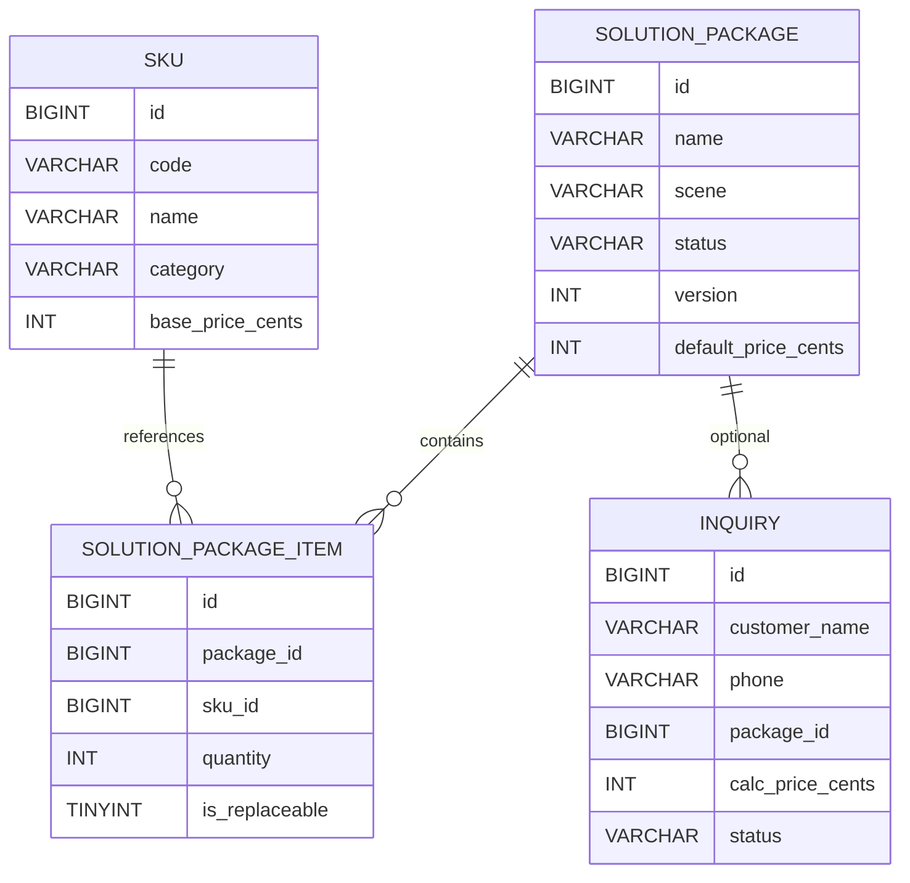

# 后端详细设计文档 v1（MVP）

## 1. 范围与目标

面向 `doc/plan.md` 的 M1/M2 目标，提供：
1. API 结构与关键接口列表（v1）。
2. 核心数据模型与表设计（方案包、SKU、询价）。
3. 规则与价格计算的最小可行设计（可配置、可扩展）。

非范围：
- 复杂审批流、ERP/CRM/WMS 对接、完整权限体系（M2/M3）。

## 2. 领域模型与职责

### 2.1 核心实体
- 方案包：对外展示的可售方案（场景、适用范围、默认配置）。
- SKU：可配置组件（压缩机、冷风机、阀件、安装服务等）。
- 方案包明细：方案内的 SKU 清单，定义数量与可替换性。
- 询价：客户提交的配置与项目信息。

### 2.2 关键关系
- 一个方案包包含多个方案包明细。
- 一个方案包明细引用一个 SKU。
- 询价关联可选方案包与用户配置（JSON 形式存储）。

## 3. API 结构（v1）

公共端（H5）：
1. `GET /api/packages`：方案包列表（支持场景/面积筛选）。
2. `GET /api/packages/{id}`：方案包详情（组件清单 + 默认价格）。
3. `POST /api/pricing/calc`：输入当前配置计算价格。
4. `POST /api/rules/validate`：校验兼容并返回替代建议。
5. `POST /api/inquiries`：提交询价。

后台（管理台）：
1. `GET /api/admin/packages`：方案包查询。
2. `POST /api/admin/packages`：新建方案包。
3. `PUT /api/admin/packages/{id}`：更新方案包。
4. `POST /api/admin/packages/{id}/publish`：发布方案包。
5. `POST /api/admin/packages/{id}/unpublish`：下架方案包。
6. `GET /api/admin/skus`：SKU 列表与筛选。
7. `POST /api/admin/skus`：新建 SKU。
8. `PUT /api/admin/skus/{id}`：更新 SKU。
9. `GET /api/admin/inquiries`：询价列表。
10. `GET /api/admin/inquiries/{id}`：询价详情。

## 4. API 请求/响应概要（v1）

### 4.1 `GET /api/packages`
返回：方案包基础信息（名称、场景、默认价、标签）。

### 4.2 `GET /api/packages/{id}`
返回：方案包详情 + SKU 明细（数量、可替换）。

### 4.3 `POST /api/pricing/calc`
请求：
- `package_id`（可选）
- `items`（SKU 列表 + 数量）
- `region_code`（可选）

响应：
- `total_price_cents`
- `region_factor`（地区系数占位，默认 1.0）
- `breakdown`（分项价格）
- `items`（计算后 SKU 明细，含单价与小计）

### 4.4 `POST /api/rules/validate`
请求：
- `items`（SKU 列表 + 数量）
- `scene`/`area`（可选）

响应：
- `is_compatible`
- `violations`（不兼容原因列表）
- `replacements`（推荐替代 SKU 列表）
- `compat_summary`（兼容性摘要，便于前端展示）

### 4.5 `POST /api/inquiries`
请求：
- `customer_name`
- `phone`
- `project_address`
- `area`
- `scene`
- `package_id`（可选）
- `selected_config_json`
- `calc_price_cents`

响应：
- `inquiry_id`
- `status`

## 5. 规则与定价计算（MVP 设计）

### 5.1 兼容规则（规则表/规则引擎）
- 规则存储为 JSON：`condition_json` + `action_json`。
- 服务端加载规则并执行：
  - 条件匹配（温区/电源/制冷剂/面积阈值等）。
  - 动作输出（阻断/警告/替代推荐）。

### 5.2 价格计算
MVP 先做：
1. 基础价 = SKU 基准价 * 数量。
2. 地区系数（占位字段，默认 1.0，可由地区映射表或 JSON 规则提供）。
3. 输出分项价格 + 总价。

二期可扩展：
- 阶梯价、促销、毛利红线审批。

## 6. 核心表结构（DDL v1）

仅包含：方案包、SKU、询价（含关联表）。

```sql
CREATE TABLE solution_package (
  id BIGINT PRIMARY KEY AUTO_INCREMENT,
  name VARCHAR(128) NOT NULL,
  scene VARCHAR(64) NOT NULL,
  status VARCHAR(16) NOT NULL,
  version INT NOT NULL DEFAULT 1,
  default_price_cents INT NOT NULL DEFAULT 0,
  tags JSON NULL,
  summary VARCHAR(255) NULL,
  created_by BIGINT NULL,
  updated_by BIGINT NULL,
  created_at DATETIME NOT NULL DEFAULT CURRENT_TIMESTAMP,
  updated_at DATETIME NOT NULL DEFAULT CURRENT_TIMESTAMP ON UPDATE CURRENT_TIMESTAMP,
  deleted_at DATETIME NULL
);

CREATE TABLE sku (
  id BIGINT PRIMARY KEY AUTO_INCREMENT,
  code VARCHAR(64) NOT NULL UNIQUE,
  name VARCHAR(128) NOT NULL,
  category VARCHAR(64) NOT NULL,
  model VARCHAR(64) NULL,
  specs_json JSON NULL,
  power_kw DECIMAL(10,2) NULL,
  temp_zone VARCHAR(32) NULL,
  voltage VARCHAR(32) NULL,
  refrigerant VARCHAR(32) NULL,
  base_price_cents INT NOT NULL DEFAULT 0,
  stock_status VARCHAR(16) NOT NULL DEFAULT 'in_stock',
  is_active TINYINT NOT NULL DEFAULT 1,
  created_at DATETIME NOT NULL DEFAULT CURRENT_TIMESTAMP,
  updated_at DATETIME NOT NULL DEFAULT CURRENT_TIMESTAMP ON UPDATE CURRENT_TIMESTAMP,
  deleted_at DATETIME NULL
);

CREATE TABLE solution_package_item (
  id BIGINT PRIMARY KEY AUTO_INCREMENT,
  package_id BIGINT NOT NULL,
  sku_id BIGINT NOT NULL,
  quantity INT NOT NULL DEFAULT 1,
  is_replaceable TINYINT NOT NULL DEFAULT 0,
  group_key VARCHAR(64) NULL,
  sort_order INT NOT NULL DEFAULT 0,
  created_at DATETIME NOT NULL DEFAULT CURRENT_TIMESTAMP,
  updated_at DATETIME NOT NULL DEFAULT CURRENT_TIMESTAMP ON UPDATE CURRENT_TIMESTAMP,
  deleted_at DATETIME NULL,
  FOREIGN KEY (package_id) REFERENCES solution_package(id),
  FOREIGN KEY (sku_id) REFERENCES sku(id)
);

CREATE TABLE inquiry (
  id BIGINT PRIMARY KEY AUTO_INCREMENT,
  customer_name VARCHAR(64) NOT NULL,
  phone VARCHAR(32) NOT NULL,
  project_address VARCHAR(255) NULL,
  area DECIMAL(10,2) NULL,
  scene VARCHAR(64) NULL,
  package_id BIGINT NULL,
  selected_config_json JSON NOT NULL,
  calc_price_cents INT NOT NULL DEFAULT 0,
  status VARCHAR(16) NOT NULL DEFAULT 'new',
  assigned_to BIGINT NULL,
  created_at DATETIME NOT NULL DEFAULT CURRENT_TIMESTAMP,
  updated_at DATETIME NOT NULL DEFAULT CURRENT_TIMESTAMP ON UPDATE CURRENT_TIMESTAMP,
  FOREIGN KEY (package_id) REFERENCES solution_package(id)
);
```

## 7. ER 图（v1）



## 8. 里程碑交付物对齐

Week 1-2：
1. 后端详细设计文档 v1（本文件）。
2. ER 图 v1（本文件）。
3. API 列表 v1（本文件）。
4. 核心 DDL（本文件）。
